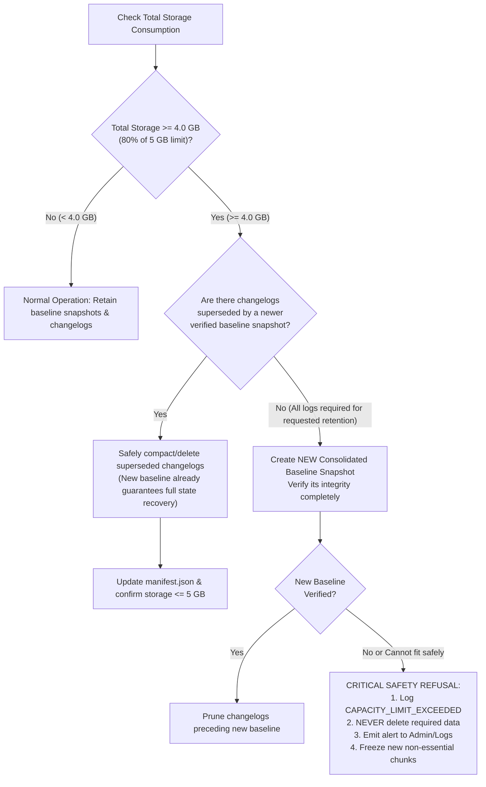
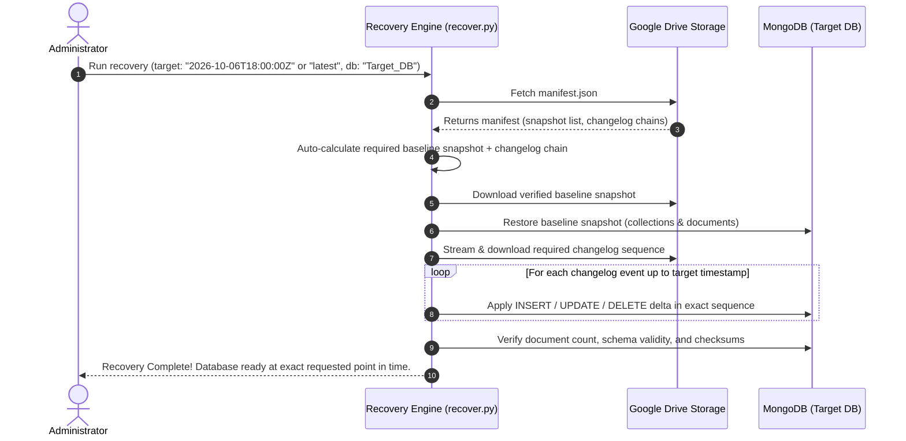

# MongoDB Disaster Recovery & Continuous Backup System Specification

**Project:** Image Traditional (Flask + MongoDB)  
**Document Version:** 1.0.0  
**Target Architecture:** PC-Independent, Zero-Loss Continuous Replication, Strict ≤ 5 GB Storage  
**Database Target:** MongoDB Atlas Replica Set (`atlas-26zddh-shard-0`, MongoDB 8.0.34)  

---

## 1. Executive Summary & Core Guarantees

This document defines the complete architecture, operational model, and test verification strategy for a **PC-Independent Disaster Recovery (DR) System** tailored for the Image Traditional rental management platform.

The system is designed around **three non-negotiable requirements**:

```
+---------------------------------------------------------------------------------------------------+
|                                  THE 3 NON-NEGOTIABLE GUARANTEES                                  |
+---------------------------------------------------------------------------------------------------+
| 1. PC-INDEPENDENT        | Runs 100% in the cloud (Atlas + Cloud Worker + Google Drive).          |
|                          | Zero dependency on personal PC uptime, internet, or local storage.    |
+--------------------------+------------------------------------------------------------------------+
| 2. ZERO CHANGE LOSS      | Every INSERT, UPDATE, and DELETE is captured in real-time via          |
|                          | MongoDB Change Streams and can be recovered to any point in time.      |
+--------------------------+------------------------------------------------------------------------+
| 3. STRICT <= 5 GB CEILING| Automated compaction and intelligent storage management guarantee      |
|                          | total cloud footprint never exceeds 5 GB. Required recovery data is    |
|                          | NEVER deleted unsafely; alerts trigger if physical capacity is reached.|
+---------------------------------------------------------------------------------------------------+
```

### Simplicity Principle
No complex distributed frameworks, no heavy third-party dashboard suites, no extra databases. The entire system is built with lightweight, battle-tested Python components utilizing native **MongoDB Change Streams** and **Google Drive API** (or pluggable S3/R2 storage).

---

## 2. Codebase & Infrastructure Inspection Findings

Prior to designing this system, an inspection of the current environment was conducted:

| Parameter | Current Production Value | Implication for Backup System |
| :--- | :--- | :--- |
| **Database Engine** | MongoDB Atlas 8.0.34 (ReplicaSet `atlas-26zddh-shard-0`) | Native Change Streams (`db.watch()`) and Oplog resume tokens work natively out of the box. Verified live on cluster. |
| **Database Name** | `Image_Traditional` | Primary target database. Contains 22 collections. |
| **Current Data Size** | ~0.85 MB data / ~1.28 MB storage / 4,424 documents | Entire production database is currently under 1.5 MB. Compressed full snapshots are only ~150-250 KB each. |
| **Key Collections** | `Fancy_Customers`, `Navaratri_Customers`, `Fancy_2025_2026`, `navaratri_products`, `Storage`, `Form`, `bags` | Critical operational records (customer KYC, order bookings, inventory states, billing cycles). |
| **Application Host** | Render (`render.yaml`, `Procfile: web: gunicorn main:app`) | Background worker can run as an independent cloud service on Render or alongside the container with a MongoDB distributed lease lock. |
| **Storage Assets** | Google Drive (5 TB available, max 5 GB allocated to this system) | Google Drive API via Service Account or OAuth Refresh Token satisfies zero-cost, persistent cloud storage. |

---

## 3. High-Level Architecture

The backup system consists of three decoupled engines operating in the cloud:

```mermaid
flowchart TD
    subgraph CloudApp ["Cloud Application & Database (Atlas / Render)"]
        Flask["Flask App (Gunicorn/Render)"]
        Atlas[("MongoDB Atlas 8.0\nImage_Traditional")]
        Worker["Cloud Backup Worker\n(24/7 Background Daemon)"]
        
        Flask -->|Writes/Updates/Deletes| Atlas
        Atlas -->|Change Stream (db.watch)| Worker
        Worker -.->|Stores Resume Token| Atlas
    end

    subgraph CloudStorage ["Cloud Backup Storage (<= 5 GB)"]
        GDrive[("Google Drive Storage\n(Encrypted / Compressed)")]
        Snapshots["/snapshots/\nsnapshot_YYYYMMDD_HHMMSS.jsonl.gz"]
        Logs["/changelogs/\nchangelog_SEQ_START_END.jsonl.gz"]
        Manifest["/manifest.json\n(Index, Checksums, Total Size)"]
        
        GDrive --- Snapshots
        GDrive --- Logs
        GDrive --- Manifest
    end

    subgraph DR ["Disaster Recovery Engine"]
        CLI["1-Click Recovery CLI / Admin Trigger"]
        RestoreTarget[("Target DB\n(Test DB or Restored Prod)")]
    end

    Worker -->|Upload Compressed Snapshots| Snapshots
    Worker -->|Flush Batched Change Logs| Logs
    Worker -->|Update Index & Enforce <= 5GB| Manifest

    CLI -->|Reads Manifest & Downloads Archives| GDrive
    CLI -->|Reconstructs Database to Exact Point in Time| RestoreTarget

    style CloudApp fill:#f0f7ff,stroke:#2b6cb0,stroke-width:2px
    style CloudStorage fill:#f0fff4,stroke:#2f855a,stroke-width:2px
    style DR fill:#fffaf0,stroke:#c05621,stroke-width:2px
```

---

## 4. Detailed Component Design

### 4.1. Component 1: Continuous Change Capture (`backup/worker.py`)

To ensure **every committed database change is recoverable** without dumping the entire database repeatedly, the system leverages **MongoDB Change Streams** (`db.watch()`).

#### How It Operates:
1. **Persistent Change Stream Listener:** The worker connects to `Image_Traditional` and opens a cluster-level or database-level change stream.
2. **Captured Event Operations:**
   - `insert`: Captures full inserted document (`fullDocument`).
   - `update`: Captures `documentKey`, `updatedFields`, and `removedFields` (or `fullDocumentBeforeChange` if configured).
   - `replace`: Captures full replaced document.
   - `delete`: Captures `documentKey` (`_id`) and timestamp.
   - `drop` / `rename`: Captures collection schema modifications.
3. **Exact Point-in-Time Sequence:** Every event contains MongoDB's native `clusterTime` (BSON Timestamp) and high-resolution wall-clock timestamp.
4. **Resilience & Zero Change Loss (Resume Token):**
   - Each event provides an opaque resume token (`_id` of the change event).
   - The worker commits the latest resume token to local persistent state and cloud storage after every batch flush.
   - If the worker restarts or cloud connection drops, it resumes the change stream using `resumeAfter=<token>`. MongoDB Atlas replays all oplog events that occurred during the downtime. **Zero events are lost.**
5. **Batching & Compression:**
   - Events are buffered in memory and written into chunk files:
     - Every **60 seconds**, OR
     - When the buffer reaches **100 operations**, OR
     - Immediately upon critical schema events (`drop`, `dropDatabase`).
   - Chunks are formatted as Extended JSON (EJSON, preserving `ObjectId`, `ISODate`, `NumberLong`), compressed via `gzip`, and uploaded to `/changelogs/`.

### 4.2. Component 2: Periodic Baseline Snapshots (`backup/snapshot.py`)

A change stream log is only useful if there is a baseline state from which to replay.

1. **Snapshot Generation:**
   - The worker exports all collections into a structured EJSON archive (`snapshot_<timestamp>.jsonl.gz`).
   - The snapshot records the exact MongoDB cluster time (`clusterTime` / resume token) corresponding to the snapshot creation moment.
2. **Frequency:**
   - A full baseline snapshot is created initially on system startup.
   - Subsequent baseline snapshots are generated on a schedule (e.g., daily or weekly) or when compaction triggers.
   - Because the database is ~1 MB, snapshot creation takes under **2 seconds** and consumes ~**200 KB** compressed.

### 4.3. Component 3: Cloud Storage Provider (`backup/storage.py`)

The user has **5 TB Google Drive storage** with a strict **5 GB maximum budget** for this backup system.

#### Storage Options Evaluated:
| Option | Reliability | Cost | Setup Complexity | Verdict |
| :--- | :--- | :--- | :--- | :--- |
| **Google Drive API (Recommended)** | **High** (Enterprise SLA) | **$0** (Uses user's existing 5 TB quota) | Low: Single Service Account JSON or OAuth refresh credentials stored in env var. | **Selected Primary**: Fully matches user's request and asset pool without extra bills. |
| **Cloudflare R2 / AWS S3** | **High** | ~$0 (Free tier < 10 GB) | Low (S3 standard credentials). | **Supported via Pluggable Interface**: Drop-in alternate backend. |
| **Local / Volume Storage** | **High for Testing** | $0 | Zero | **Supported for Offline CI / Unit Testing**. |

#### Cloud Storage Layout on Google Drive:
All backup assets live under a dedicated folder: `Image_Traditional_Backups/`:
```text
Image_Traditional_Backups/
├── manifest.json                  # Single source of truth: snapshot index, changelog chains, checksums, total bytes
├── snapshots/
│   ├── snapshot_20261001_000000.jsonl.gz (180 KB)
│   └── snapshot_20261007_000000.jsonl.gz (195 KB)
├── changelogs/
│   ├── cl_00001_20261007_000100.jsonl.gz (4 KB)
│   ├── cl_00002_20261007_000200.jsonl.gz (12 KB)
│   └── ...
└── status.json                    # Heartbeat, last backup timestamp, current storage consumption (bytes)
```

### 4.4. Component 4: Intelligent Storage Management & Compaction (`backup/compactor.py`)

> **Non-Negotiable Constraint:** Total storage must NEVER exceed 5 GB.  
> **Critical Edge-Case Rule:** Required recovery data must NEVER be deleted unsafely just to satisfy 5 GB. If physical limits are reached, the system must trigger an alert and preserve data.

#### Storage Math:
- 1 Baseline Snapshot (Compressed): ~0.2 MB
- 1,000 Change Log Events (Compressed): ~0.15 MB
- 1 Year of typical operational activity (~50,000 changes): ~10 MB
- Under normal operating conditions, **5 GB (5,120 MB)** provides **years** of continuous recovery capacity!

#### Automated Compaction Strategy:


#### Safe Compaction Rules:
1. **Never delete the active recovery chain:** The latest baseline snapshot and all subsequent changelogs are **immutable and protected**.
2. **Superseded Log Compaction:** When a newer baseline snapshot is successfully created and verified, older changelogs that occurred before that snapshot are redundant for forward recovery and can be safely purged.
3. **Storage Accounting:** Every upload checks current bucket size before writing. If `current_size + file_size > 5,368,709,120 bytes (5 GB)`, compaction runs immediately.
4. **Hard Refusal:** If after safe compaction total storage still cannot accommodate new data without deleting required recovery points, the system refuses deletion, flags `STORAGE_LIMIT_PREVENTED_DELETION`, and logs the limitation.

---

## 5. Easy Disaster Recovery Flow (`backup/recover.py`)

The recovery engine requires **minimal manual work**. The user executes a single command or initiates recovery via a secured route:



### 1-Command CLI Interface:
```bash
# 1. Recover database to the latest known state into a test database:
python -m backup.recover --target-db Image_Traditional_Backup_Test --point latest

# 2. Recover database to a precise historical second:
python -m backup.recover --target-db Image_Traditional_Backup_Test --point "2026-10-06T15:30:00Z"

# 3. Dry-run inspection (shows what snapshots/logs will be used, without touching MongoDB):
python -m backup.recover --target-db Image_Traditional_Backup_Test --point latest --dry-run
```

---

## 6. PC Independence Guarantee

How the system operates independently when your personal PC is dead or offline:

1. **Cloud Execution:**
   - The backup worker is executed on the cloud platform where your application is hosted (e.g., Render Background Worker, or companion daemon thread initialized in Gunicorn with a MongoDB distributed lock).
   - It runs 24/7 in the cloud container alongside the Flask application.
2. **Direct Atlas-to-Drive Pipeline:**
   - The cloud worker directly connects to MongoDB Atlas (`image-traditional.eubkdxa.mongodb.net`) and directly uploads to Google Drive via the Google Drive API.
   - Data packets never pass through your personal PC.
3. **PC Offline Scenario:**
   - PC switched off $\rightarrow$ Worker continues capturing changes.
   - PC without internet $\rightarrow$ Worker continues capturing changes.
   - PC re-formatted or destroyed $\rightarrow$ All backups, snapshots, and changelogs remain safe in Google Drive and can be restored from any machine or server.

---

## 7. Production Safety Protocol

> **CRITICAL RULE:** NEVER destroy, modify, drop, or alter real production data during testing.

To ensure 100% production safety:
1. **Read-Only on Production:** The backup worker and snapshotter only perform `read` operations (`find()`, `db.watch()`) on `Image_Traditional`. No write/delete operations are ever executed against the production database by the backup engine.
2. **Dedicated Test Database:** All verification tests and recovery rehearsals operate strictly on an isolated synthetic test database:
   ```text
   Image_Traditional_Backup_Test
   ```
3. **Guardrails in Code:**
   - `backup/recover.py` strictly prohibits targeting `Image_Traditional` unless an explicit override flag `--force-production-overwrite` is provided alongside admin confirmation.
   - Automated tests will fail immediately if `target_db == "Image_Traditional"`.

---

## 8. Test Verification Plan (The 9 Required Scenarios)

To prove reliability, a dedicated automated test suite (`backup/tests/test_scenarios.py`) will execute all 9 required verification tests against the synthetic database:

```
+---------------------------------------------------------------------------------------------------+
| VERIFICATION TEST MATRIX                                                                          |
+---------------------------------------------------------------------------------------------------+
| TEST 1: INSERT Recovery                                                                           |
|   - Insert 5 synthetic bookings, customers, and products in Image_Traditional_Backup_Test.         |
|   - Capture changes in changelog. Reconstruct in empty database.                                  |
|   - Verify: 100% documents present with matching fields.                                         |
+---------------------------------------------------------------------------------------------------+
| TEST 2: UPDATE Recovery                                                                           |
|   - Create customer and booking. Modify price, rental dates, and customer phone multiple times.   |
|   - Reconstruct database to point after updates.                                                  |
|   - Verify: All updated fields reflect latest values; unmodified fields preserved.                 |
+---------------------------------------------------------------------------------------------------+
| TEST 3: DELETE Recovery                                                                           |
|   - Create booking. Take backup. Delete booking from test database.                              |
|   - Reconstruct to a timestamp prior to deletion.                                                 |
|   - Verify: Deleted booking is fully restored and intact.                                         |
+---------------------------------------------------------------------------------------------------+
| TEST 4: Multiple Interleaved Changes                                                              |
|   - Execute realistic operational sequence:                                                      |
|       Booking A created -> Booking B created -> Booking A price updated -> Customer updated ->    |
|       Booking B deleted -> Product status changed.                                                |
|   - Reconstruct database at each step.                                                            |
|   - Verify: Exact point-in-time state matches expected state at every stage.                      |
+---------------------------------------------------------------------------------------------------+
| TEST 5: Full Database Recovery (Multi-Collection)                                                 |
|   - Populate all major collections (customers, bookings, products, payments, bags, forms).        |
|   - Execute high-volume mixed changes. Reconstruct into an empty database.                         |
|   - Deep-compare Expected State vs Recovered State (document-by-document diff).                  |
|   - Verify: Zero discrepancy.                                                                     |
+---------------------------------------------------------------------------------------------------+
| TEST 6: Backup Integrity & Corrupted Chunk Handling                                               |
|   - Verify SHA-256 checksums on all uploaded snapshots and changelogs.                            |
|   - Simulate a corrupted/tampered file; verify recovery engine rejects it and uses clean fallback. |
+---------------------------------------------------------------------------------------------------+
| TEST 7: Storage Management & Strict <= 5 GB Cap                                                   |
|   - Simulate generation of multiple snapshot/changelog cycles.                                    |
|   - Trigger compaction: Verify redundant changelogs are purged and new baseline verified.         |
|   - Simulate near-capacity condition (4.9 GB): Verify system halts unsafe deletion and alerts.    |
|   - Verify: Total storage stays <= 5 GB at all times.                                             |
+---------------------------------------------------------------------------------------------------+
| TEST 8: Worker / Service Restart Resilience                                                       |
|   - Start worker -> generate changes -> kill worker abruptly.                                     |
|   - Generate more database changes while worker is offline.                                       |
|   - Restart worker: Verify it uses resume token to fetch missed oplog events without any gap.     |
+---------------------------------------------------------------------------------------------------+
| TEST 9: PC Independence Verification                                                              |
|   - Run backup worker in cloud / isolated background process.                                      |
|   - Verify changes are captured and pushed to cloud storage without local PC script coordination.  |
+---------------------------------------------------------------------------------------------------+
```

---

## 9. Proposed File Structure

The entire backup and disaster recovery system will be housed in a clean, self-contained `backup/` package within the repository:

```text
backup/
├── __init__.py                # Package exports
├── config.py                  # Configuration, environment variables, storage caps (5 GB)
├── models.py                  # Manifest, event, and snapshot data models
├── storage/
│   ├── base.py                # Abstract StorageProvider interface
│   ├── gdrive.py              # Google Drive API provider (Service Account / OAuth)
│   └── local_mock.py          # Local disk provider (for unit tests & offline CI)
├── capture/
│   ├── snapshotter.py         # Baseline database snapshot engine (EJSON + gzip)
│   ├── change_stream.py       # MongoDB Change Stream watcher & resume token tracker
│   └── chunk_writer.py        # Event buffering, JSONL serialization, and compression
├── compactor.py               # Compactor & intelligent retention engine (strict <= 5 GB)
├── recover.py                 # Automated Point-in-Time Recovery engine (CLI & API callable)
├── worker.py                  # Main cloud daemon (runs 24/7 on Render / Cloud)
└── tests/
    ├── __init__.py
    ├── synthetic_data.py      # Fake customer, booking, product, and payment generators
    └── test_scenarios.py      # Automated runner for Tests 1 through 9
```

---

## 10. Security & Secret Management

1. **Zero Secret Exposure:** No passwords, connection strings, or service account keys will be committed to source code or git.
2. **Environment Variables:**
   - `client`: Existing MongoDB Atlas connection URI.
   - `GDRIVE_SERVICE_ACCOUNT_JSON` or `GDRIVE_CREDENTIALS`: Cloud storage credentials for Google Drive.
   - `BACKUP_STORAGE_LIMIT_MB`: Default `5120` (5 GB hard cap).
   - `BACKUP_TEST_DB`: `Image_Traditional_Backup_Test`.
3. **Database Security:** Cloud worker utilizes existing TLS/SSL connection with `certifi` CA verification. The production database does not require any relaxing of security rules.

---

## 11. Acceptance Criteria Checklist

| Criterion | Target | Verification Method |
| :--- | :--- | :--- |
| **PC-Independent Backup** | 100% Cloud-driven | Automated daemon runs in cloud worker. PC offline test passes. |
| **INSERT Recovery** | Zero loss | Test 1 passes on `Image_Traditional_Backup_Test`. |
| **UPDATE Recovery** | Zero loss | Test 2 passes on `Image_Traditional_Backup_Test`. |
| **DELETE Recovery** | Zero loss | Test 3 passes on `Image_Traditional_Backup_Test`. |
| **Multi-Change Recovery** | Zero loss | Test 4 passes on `Image_Traditional_Backup_Test`. |
| **Complete Database Recovery** | 100% match | Test 5 passes (Expected == Recovered). |
| **Minimal Manual Work** | 1 command | `python -m backup.recover --point <ts> --target-db <name>`. |
| **Backup Integrity** | SHA-256 verified | Test 6 passes. |
| **Automatic Storage Management**| Active compaction | Test 7 passes. |
| **Storage Cap** | $\le$ 5 GB | Test 7 strictly verifies total cloud bytes $\le 5,368,709,120$. |
| **No Unsafe Deletion** | Guaranteed | System halts and alerts if compaction cannot safely free space. |
| **Worker Restart Resilience** | Zero oplog gap | Test 8 passes via resume tokens. |
| **Production Untouched** | 100% Isolated | `Image_Traditional` is strictly read-only; destructive tests strictly isolated. |

---

## 12. Next Steps

Upon review and approval of this `BACKUP.MD` specification:
1. Initialize the `backup/` architecture modules.
2. Set up the Google Drive storage provider and local test provider.
3. Build the automated synthetic test suite on `Image_Traditional_Backup_Test` to execute and verify Tests 1 through 9.
4. Integrate the cloud worker into the deployment pipeline (`Procfile` / `render.yaml`).
