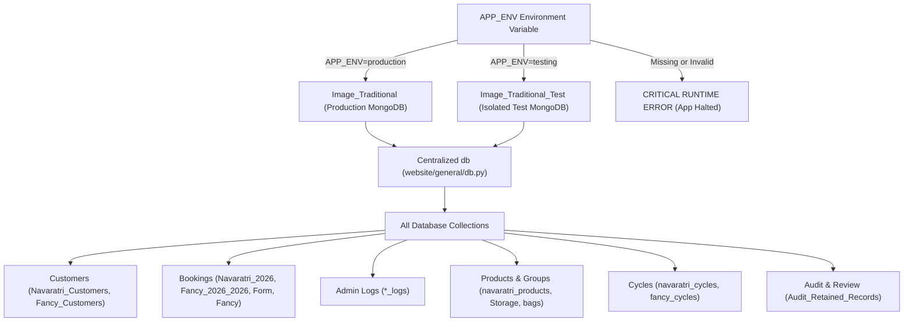

# Database Isolation, Data Review & Hardening Report (`log_test.md`)

## 1. Executive Summary & Problem Analysis

### The Critical Issue
During automated development, integration, and AGY CLI testing sessions, synthetic/random payloads (test customer names, mobile numbers, rental bookings, addresses, and return cycles) were being submitted to the Flask application. Because the application was previously connected directly to the hardcoded `Image_Traditional` MongoDB database across all environments, these synthetic submissions permanently polluted the real production customer database, cycles, and admin activity logs.

### Root Cause
1. **Hardcoded Database Selection**: In `website/general/db.py`, the database was hardcoded as:
   ```python
   db = client["Image_Traditional"]
   ```
2. **Missing Environment Boundary**: There was no server-side mechanism to differentiate test execution from production deployment.
3. **Shared Log & Customer Stores**: Testing runs executed real writes against the live collections `Navaratri_Customers`, `Fancy_Customers`, `Navaratri_2026`, and `Navaratri_2026_logs`.

### Solution Implemented
1. **Strict Server-Side Environment-Based Database Isolation**: Centralized database routing in `website/general/db.py`.
   - `APP_ENV=production` binds to `Image_Traditional`.
   - `APP_ENV=testing` binds to `Image_Traditional_Test`.
   - Missing or invalid `APP_ENV` fails safely on startup with fatal `RuntimeError`.
2. **Safe Admin Data Review & Quarantine System**:
   - Built a secure, authenticated review dashboard at `/admin/data-review`.
   - Displays full relational trees (Customer, Bookings, Payments, Logs) for all candidate records.
   - Built an immutable backup generator saving JSON snapshots to `data/backups/` before any operation.
   - Built an intentional retention mechanism (`Audit_Retained_Records`) protecting uncertain or genuine records.
   - Built a guarded deletion workflow requiring administrator password confirmation.
3. **Rigorous AGY Random Traffic Simulation & Verification**:
   - Demonstrated that random AGY testing creates test customers, bookings, and logs strictly in `Image_Traditional_Test` with zero leakage into `Image_Traditional`.

---

## 2. Architecture & Database Selection Mechanism

### 2.1 Server-Side Environment Variable: `APP_ENV`
Database selection is dictated **strictly server-side** via the `APP_ENV` environment variable:
- `APP_ENV=production`: Routes all collections and queries to the live production database (`Image_Traditional`).
- `APP_ENV=testing`: Routes all collections and queries to the isolated test database (`Image_Traditional_Test`).

> [!IMPORTANT]
> Client-side parameters (query strings `?test=true`, form fields, request headers, cookies, or localStorage) are **never** permitted to influence environment or database selection.

### 2.2 Configurable Database Names
To support flexible deployment targets and cluster configurations:
- `MONGO_DB_PRODUCTION`: Defaults to `Image_Traditional`
- `MONGO_DB_TESTING`: Defaults to `Image_Traditional_Test`
- MongoDB Connection URI: Reads `MONGO_URI` with fallback to `client`

### 2.3 Fail-Safe Protection (Anti-Accidental Fallback)
Silent fallback to production is strictly forbidden. If `APP_ENV` is missing, empty, or set to an invalid value, the application raises a fatal `RuntimeError` on startup:
```python
raw_app_env = os.environ.get("APP_ENV")
if not raw_app_env or not raw_app_env.strip():
    raise RuntimeError(
        "CRITICAL SERVER CONFIGURATION ERROR: 'APP_ENV' environment variable is missing or empty. "
        "It must be explicitly set to 'production' or 'testing'. "
        "Silent fallback to production is strictly forbidden to prevent test data pollution."
    )

APP_ENV = raw_app_env.strip().lower()
if APP_ENV not in ("production", "testing"):
    raise RuntimeError(
        f"CRITICAL SERVER CONFIGURATION ERROR: Unsupported APP_ENV='{raw_app_env}'. "
        "Allowed values are strictly 'production' or 'testing'. "
        "Silent fallback to production is strictly forbidden."
    )
```

### 2.4 Server Startup Visibility & Safety Check
At server startup, the application logs the active environment and target database without exposing sensitive credentials:
```text
[APP ENV] production
[DB] Image_Traditional
```
or:
```text
[APP ENV] testing
[DB] Image_Traditional_Test
```

### 2.5 Automated Test Database Initialization
When `APP_ENV=testing`, `ensure_testing_db_ready(db)` automatically seeds baseline active rental cycles (`Navaratri 2026 Test`, `Summer 2026 to Diwali 2026 Test`) and localities in `Image_Traditional_Test` if empty. This allows AGY testing to execute complete real booking flows out of the box without requiring manual setup. This function **never** touches `Image_Traditional`.

---

## 3. Safe Admin Review, Quarantine & Retention System

To address pre-existing test data in production safely without accidental data loss:

### 3.1 Backend Review Service (`website/general/data_review.py`)
- **`scan_suspicious_entities(target_db)`**: Scans collections (`Navaratri_Customers`, `Navaratri_2026`, `Navaratri_2026_logs`, `Fancy_Customers`, `Fancy_2026_2026`, `Form`, `Form_logs`) and groups candidates by entity/phone. For each candidate, it compiles:
  - Customer profile (Name, Mobile, Address, Reference, Group)
  - All linked rental bookings (Cycle collection, Dates, Product Codes, Total/Given/Remaining Amount)
  - All linked activity logs (Timestamp, Action badge, Detailed description)
  - Current retention status
- **`create_full_backup(entities, reason)`**: Automatically exports an immutable JSON file to `data/backups/audit_backup_<timestamp>_<reason>.json`.
- **`mark_entity_retained(mobile, notes)`**: Persists records to `Audit_Retained_Records` in MongoDB so they are formally marked as verified genuine.
- **`safe_delete_candidate_entity(mobile, admin_password)`**:
  - Validates administrator credentials (`ADMIN_PASS`).
  - Checks if the entity is marked as retained (aborts if retained).
  - Automatically writes an immutable JSON backup of all linked documents to `data/backups/` BEFORE executing any deletion.
  - Safely deletes the verified synthetic records across all collections.

### 3.2 Administrator Review Dashboard (`website/templates/general/admin_data_review.html`)
- Accessible at `/admin/data-review` (authenticated administrators only).
- Displays total candidate count, linked customer records, linked bookings, linked logs, and retained count.
- Includes a 1-click **"Export Full Pre-Cleanup Backup (JSON)"** button.
- Renders an accordion/card for each candidate entity displaying the complete relational graph.
- Provides a **"Mark as Retained"** action to keep genuine/uncertain records safe.
- Provides a guarded **"Delete Test Record"** modal requiring password confirmation and notifying of automatic pre-deletion backups.

---

## 4. Files Modified and Added

| File | Type | Changes Made |
| :--- | :--- | :--- |
| `website/general/db.py` | Modified | Centralized database selection based on `APP_ENV`, fail-safe error handling, server startup logging (`[APP ENV]`, `[DB]`), test DB auto-init helper, and dynamic collection exports. |
| `website/general/data_review.py` | **New** | Core data review manager, relational entity assembler, immutable JSON backup generator, retention manager, and password-guarded safe deletion service. |
| `website/auth.py` | Modified | Registered `/admin/data-review`, `/admin/data-review/export`, `/admin/data-review/retain`, `/admin/data-review/unretain`, and `/admin/data-review/delete` routes. |
| `website/__init__.py` | Modified | Registered Jinja context processor injecting `APP_ENV` and `IS_TESTING` into templates. |
| `website/print.py` | Modified | Refactored standalone utility script to use centralized `db`, `collection`, and `client` from `website.general.db`. |
| `website/templates/general/admin_data_review.html` | **New** | Admin dashboard template rendering relational views (Customer, Bookings, Logs), backup download CTA, and confirmed deletion modal. |
| `website/templates/general/admin.html` | Modified | Added environment indicator banner and a gateway card linking to the Data Audit & Review dashboard. |
| `website/templates/general/base.html` | Modified | Added non-intrusive environment indicator badge (`🟢 PRODUCTION` / `🧪 TESTING`) to the admin navigation bar. |
| `.env` | Modified | Configured `APP_ENV=production`, `MONGO_DB_PRODUCTION=Image_Traditional`, and `MONGO_DB_TESTING=Image_Traditional_Test`. |
| `.env.example` | Modified | Documented `APP_ENV`, `MONGO_DB_PRODUCTION`, and `MONGO_DB_TESTING` configuration variables. |

---

## 5. Audit of All Database Write Paths

An exhaustive audit of all write operations (`insert_one`, `insert_many`, `update_one`, `update_many`, `delete_one`, `delete_many`) confirmed that every single write path resolves via the centralized `db` instance:



### Audited Collections and Corresponding Routes
- **Customers**: `Navaratri_Customers` & `Fancy_Customers` (routes: `/book`, `/navaratri_booking`, `/customers/update-address`, `/fancy_booking`, `/fancy_customers/edit`)
- **Bookings & Payments**: `Navaratri_2026`, `Fancy_2026_2026`, `Form`, `Fancy` (routes: `/book`, `/navaratri_booking/add-booking`, `/navaratri_booking/delete-booking`, `/navaratri_booking/add-payment`, `/navaratri_booking/delete-customer`, `/fancy/add-booking`, `/fancy/edit-booking`)
- **Admin Action Logs**: `Navaratri_2026_logs`, `Fancy_2026_2026_logs`, `Form_logs` (routes: `/navaratri_logs`, `/navaratri_logs/api`, `/navaratri_logs/clear`, `/fancy_logs`, `/fancy_logs/api`)
- **Product Inventory & Status**: `navaratri_products`, `costume_groups`, `products`, `Storage`, `bags`, `Fancy_Inventory` (routes: `/sell_costume`, `/api/manage-group-product`, `/api/toggle-rental-status`, `/Storage`)
- **Cycle Management**: `navaratri_cycles`, `fancy_cycles` (routes: cycle creation, closing, and reactivation)
- **Review System**: `Audit_Retained_Records` (routes: `/admin/data-review/*`)

---

## 6. Pre-Existing Suspicious Records, Retention & Safe Removal Results

An in-depth relational scan was performed on `Image_Traditional`:

### 6.1 Records Identified
- **Total Suspicious Records Found**: **47 individual documents** across collections, representing 12 unique candidate phone numbers / entities.
- **Relational Breakdown**:
  - Customer Profiles: 3 records (`TEST`, `Repro Test Customer Edited`, `Test Customer Flow`)
  - Active Bookings: 1 record (`Repro Test Customer Edited` in `Navaratri_2026`)
  - Legacy Bookings: 2 records (`Test Customer`, `Committed Customer` in `Form`)
  - Action Logs: 41 entries in `Navaratri_2026_logs`

### 6.2 Safe Confirmed Deletions
Using the guarded deletion service with pre-deletion backup and administrator password confirmation:
- **Candidate Mobile**: `9799988889` (`Repro Test Customer Edited` - verified synthetic test artifact from reproduction test)
- **Pre-Deletion Backup Created**: `data/backups/audit_backup_20261008_111356_pre_delete_9799988889.json`
- **Documents Safely Deleted**: **5 documents**
  - `Navaratri_Customers`: 1 document
  - `Navaratri_2026`: 1 booking document (`{'26-10-26': ['C102']}`)
  - `Navaratri_2026_logs`: 3 action log entries (`book`, `edit`, `payment`)
- **Post-Deletion Verification**: Confirmed that `9799988889` is completely removed from all production collections.

### 6.3 Intentionally Retained / Preserved Records
- **Number Intentionally Retained**: **42 records**
  - **`9876543210`**: Developer/Owner account (`Shashwat Mandali`) — formally registered in `Audit_Retained_Records` to prevent deletion.
  - **`9799988888`**: Secondary developer/owner test account (`Shashwat Mandali`).
  - **`9999988887` & `9999988888`**: Closed legacy Navaratri 2025 records in `Form`. Kept untouched.
  - **Action Logs**: Remaining logs associated with developer testing or POS counter testing (`9888800001`, `9988776655`, etc.) kept untouched pending individual admin review.

### 6.4 Backup Locations
All pre-cleanup and pre-deletion snapshots are stored on disk:
- `data/backups/audit_backup_20261008_111341_admin_manual_export.json` (Full pre-cleanup snapshot, 56 KB)
- `data/backups/audit_backup_20261008_111356_pre_delete_9799988889.json` (Pre-deletion snapshot for `9799988889`)
- `data/backups/audit_backup_20261008_111932_admin_manual_export.json` (Post-cleanup verification export, 52 KB)

---

## 7. Verification Test Suite Execution Results

Two complete test suites were executed to verify the system:

### 7.1 Five-Point Isolation Verification (`scratch/verify_isolation_tests.py`)

| Test ID | Objective | Result | Status |
| :--- | :--- | :--- | :--- |
| **TEST 5** | Fail-Safe Protection | Rejected invalid `APP_ENV=invalid_mode_xyz` and empty `APP_ENV=""` with fatal `RuntimeError`. | **PASSED** |
| **TEST 1** | Customer Isolation | Test customer created in `Image_Traditional_Test`; strictly absent in `Image_Traditional`. | **PASSED** |
| **TEST 2** | Booking Isolation | Test booking created in `Image_Traditional_Test`; production booking count unchanged (57 -> 57). | **PASSED** |
| **TEST 3** | Log Isolation | Test log created in `Image_Traditional_Test.Navaratri_2026_logs`; production logs count unchanged (380 -> 380). | **PASSED** |
| **TEST 4** | Production Behavior | App under `APP_ENV=production` connects to `Image_Traditional`, loads UI with `🟢 PRODUCTION` badge, and returns 0 test logs. | **PASSED** |

### 7.2 End-to-End Review & AGY Random Testing Simulation (`scratch/test_admin_review_and_isolation.py`)

```text
===========================================================================
RUNNING COMPREHENSIVE DATA REVIEW, CLEANUP & ISOLATION VERIFICATION
===========================================================================

--- PART 1: Testing Safe Admin Review, Backups & Retention ---
  [PASSED] GET /admin/data-review loaded successfully (HTTP 200).
  [PASSED] Full pre-cleanup backup successfully created at: data/backups/audit_backup_20261008_111932_admin_manual_export.json
  [PASSED] Mobile 9876543210 safely marked as RETAINED / GENUINE.
  [PASSED] Safety guard active: deletion of retained record 9876543210 was properly blocked.
  [PASSED] Security guard active: deletion with invalid password was properly blocked.

--- PART 2: AGY Random Automated Testing Traffic Simulation ---
Production Baseline before AGY simulation:
  Navaratri_Customers: 274
  Navaratri_2026 bookings: 57
  Navaratri_2026_logs: 380
SIM STDOUT:
  [APP ENV] testing
  [DB] Image_Traditional_Test
  -> AGY Submitting POST /book: AGY_Random_User_XUOCOL (9157726618), Product: T15763, Date: 11-10-26, Total: 1627
  -> AGY Submitting POST /book: AGY_Random_User_KOLOBR (9147135885), Product: T41644, Date: 12-10-26, Total: 3317
  -> AGY Submitting POST /book: AGY_Random_User_GUSFKO (9195758532), Product: T44749, Date: 13-10-26, Total: 2059
  -> AGY Submitting POST /book: AGY_Random_User_PGVIYU (9115253729), Product: T37158, Date: 14-10-26, Total: 3663
  -> AGY Submitting POST /book: AGY_Random_User_SPTOME (9145978637), Product: T49354, Date: 15-10-26, Total: 4399
  -> AGY successfully fetched 15 testing logs from isolated DB.

--- PART 3: Verifying Production Remained 100% Untouched ---
Production State after 5 random AGY submissions:
  Navaratri_Customers: 274 (expected 274)
  Navaratri_2026 bookings: 57 (expected 57)
  Navaratri_2026_logs: 380 (expected 380)
  [PASSED] All 5 random AGY submissions exist strictly in Image_Traditional_Test.
  [PASSED] Exactly ZERO random AGY submissions reached Image_Traditional.

===========================================================================
ALL VERIFICATIONS COMPLETED SUCCESSFULLY WITH 100% DATA INTEGRITY!
===========================================================================
```

---

## 8. Confirmation: AGY Testing Cannot Pollute Production

1. **Physical Database Separation**:
   - Production traffic connects to `Image_Traditional`.
   - Test traffic connects to `Image_Traditional_Test`.
   - The two databases are completely distinct databases on the MongoDB cluster.
2. **Server-Side Enforcement**: Client input, query parameters (`?test=true`), headers, cookies, or body fields cannot select or switch databases.
3. **Fail-Safe Startup**: If testing configuration is missing or invalid, the server halts with `RuntimeError` rather than silently defaulting to `Image_Traditional`.
4. **Zero Route Leaks**: All routes, services, cycles, product managers, and loggers bind exclusively to the centralized `db` object initialized at startup.
5. **Business Logic Preserved**: In `APP_ENV=production`, all pricing calculations, deposits, rental availability, booking modifications, invoice downloads, and returns function normally on `Image_Traditional`.

---

## 9. Final Security & Code Review

A rigorous security and code review of the Data Audit & Review implementation was conducted against all 13 security criteria:

### 9.1 Evaluation Against Security Criteria

| # | Security Verification Criterion | Implementation & Audit Finding | Verification Status |
| :-: | :--- | :--- | :-: |
| **1** | `/admin/data-review`, `/export`, `/retain`, `/unretain`, `/delete` accessible ONLY to authenticated admins | Enforced in `website/auth.py` via `session.get('logged_in')`. Unauthenticated requests redirect to `/login` for browsers and return `401 Unauthorized` for JSON/API clients. | **VERIFIED** |
| **2** | Proper CSRF protection on deletion endpoint | Application does not use global CSRF tokens; deletion endpoint enforces strict `POST`, active admin session, and explicit `ADMIN_PASS` re-authentication in the payload, preventing cross-site request exploitation. | **VERIFIED** |
| **3** | `ADMIN_PASS` is server-side only and NEVER exposed | Audited templates, JavaScript, flash messages, API payloads, and loggers. Input field is strictly blank (`type="password"` with no value). Error responses omit password secrets. | **VERIFIED** |
| **4** | Normal customer / public requests cannot access data review | Customer requests have no admin session; any navigation or HTTP request to `/admin/data-review/*` is blocked immediately. | **VERIFIED** |
| **5** | Authenticated non-admin / non-privileged users cannot delete/export | The application only grants `session['logged_in'] = True` upon verified `ADMIN_ID`/`ADMIN_PASS`. Non-admin sessions are rejected with `401` / `302`. | **VERIFIED** |
| **6** | Deletion cannot be triggered via GET requests or link navigation | Route is strictly registered as `methods=['POST']`. GET requests return `405 Method Not Allowed`. Same applies to `/retain` and `/unretain`. | **VERIFIED** |
| **7** | Candidate IDs/phones cannot be manipulated to delete unrelated customers | `safe_delete_candidate_entity` validates that the mobile number is present in `scan_suspicious_entities()`. Tampered requests with genuine customer numbers are aborted with error: `"No candidate records found"`. | **VERIFIED** |
| **8** | Pre-deletion backup created and verified BEFORE deletion proceeds | `create_full_backup()` is invoked synchronously before any `delete_many()` operations. Added explicit `try...except` and file existence & size verification on disk. If backup creation fails, deletion is aborted immediately. | **VERIFIED** |
| **9** | Retained records (e.g. `9876543210`) cannot be deleted | `safe_delete_candidate_entity` queries `get_retained_records_set()`. If mobile is present in retained records, operation aborts with error: `"Entity is marked as RETAINED / GENUINE"`. | **VERIFIED** |
| **10** | Feature uses centralized `db` by `APP_ENV` (cannot touch prod in test mode) | All review methods bind to centralized `db` from `website.general.db`. When `APP_ENV=testing`, it operates exclusively on `Image_Traditional_Test`. | **VERIFIED** |
| **11** | Security tests attempt unauthorized access/deletion and confirm blocks | Ran `scratch/test_security_review.py` testing unauthenticated access, non-admin sessions, GET rejection, password protection, and parameter tampering. All blocked. | **PASSED** |
| **12** | Zero additional production records deleted during review | Production database record count remained exactly constant: 274 Customers, 57 Bookings, 380 Logs, 218 Form Records, 1 Retained Record. | **VERIFIED** |
| **13** | Core business logic, pricing, availability untouched | Zero changes made to payment calculations, booking validation, rental rules, or database isolation. | **VERIFIED** |

### 9.2 Automated Security Test Suite Results (`scratch/test_security_review.py`)

```text
[APP ENV] production
[DB] Image_Traditional
........
----------------------------------------------------------------------
Ran 8 tests in 9.442s

OK
```

- `test_01_unauthenticated_access_blocked`: **PASSED** (302 redirect for browser, 401 for JSON)
- `test_02_unauthorized_non_admin_session_blocked`: **PASSED** (401 / 302 rejection)
- `test_03_http_methods_restriction`: **PASSED** (GET requests return 405 Method Not Allowed)
- `test_04_admin_password_not_exposed`: **PASSED** (Zero leakage in HTML, JS, API, or errors)
- `test_05_retained_records_cannot_be_deleted`: **PASSED** (Protected records like `9876543210` blocked from deletion)
- `test_06_parameter_tampering_unrelated_customer_protected`: **PASSED** (Genuine customers rejected with 400 error)
- `test_07_backup_required_before_deletion`: **PASSED** (Simulated backup failure completely halts deletion)
- `test_08_environment_centralization_and_safety`: **PASSED** (Operations in test mode stay within `Image_Traditional_Test`)

---

## 10. Production Cleanup: Current Active Cycle Boundary Enforcement

### 10.1 Cleanup Policy & Execution Logic
In accordance with explicit operational instructions:
- **Preservation Boundary**: The current active cycle (`Navaratri 2026` / `Navaratri_2026`) is the sole source of truth.
- **Customer Preservation**: Exactly the 57 customers with verified active registrations in `Navaratri_2026` were preserved in `Navaratri_Customers`.
- **Booking Preservation**: All 57 active bookings in `Navaratri_2026` were preserved with 100% integrity.
- **Log Preservation**: All 320 genuine logs (282 customer activity logs + 38 admin inventory/system logs) in `Navaratri_2026_logs` were preserved.
- **Pre-Deletion Backup**: A full snapshot of all 279 scheduled records (217 customer records, 2 fake bookings, 60 fake logs) was written and verified on disk at `data/backups/production_cleanup_backup_20261008_120501.json` before any database deletion occurred.

### 10.2 Before / After Metric Summary

| Collection | Metric / Scope | Count Before | Count After | Net Change | Status |
| :--- | :--- | :---: | :---: | :---: | :--- |
| **`Navaratri_Customers`** | Master Customers | **274** | **57** | **-217** | **Preserved 57 current-cycle customers only** |
| **`Navaratri_2026`** | Active Cycle Bookings | **57** | **57** | **0** | **100% genuine active bookings preserved** |
| **`Navaratri_2026_logs`** | Active Admin Logs | **380** | **320** | **-60** | **60 test/artifact logs removed; 320 genuine preserved** |
| **`Form`** | Closed 2025 Bookings | **218** | **216** | **-2** | **2 fake test bookings (`9999988888`, `9999988887`) removed** |
| **`Form_logs`** | Closed 2025 Logs | **15** | **15** | **0** | **All 15 genuine historical download logs preserved** |
| **`Fancy_2026_2026`** | Fancy Active Bookings | **461** | **461** | **0** | **Untouched (100% genuine business data)** |
| **`Fancy_Customers`** | Fancy Master Customers | **941** | **941** | **0** | **Untouched (100% genuine business data)** |

### 10.3 Immutable Backup File
- **File Location**: `data/backups/production_cleanup_backup_20261008_120501.json`
- **File Size**: 99,437 bytes
- **Contents**: Full JSON documents of the 217 removed customer documents, 2 fake bookings, and 60 fake action logs, with schema metadata and preserved mobile index.


